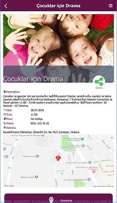
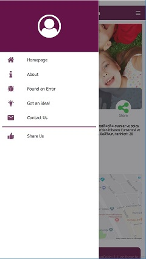

  ----------------------
  Event App Assignment
  ----------------------

About
-----

EventApp or *Şehir Etkinlikleri* is a mobile application which provides
all events in your city. It is currently available only for Ankara,
Turkey, but later who knows. Full version of this application can be
found in
[*here*](https://play.google.com/store/apps/details?id=tr.com.tusco.mobile.sehiretkinlikleri&hl=tr).

This version is an proof of concept of original one which is developed
by using V-Play Engine with Qt 5.10.1 Framework. In order to demonstrate
coding skills and documentation abilities:

-   Most of qml items are converted to V-Play items such as Flickable
    -\> AppFlickable, SwipeView -\> Navigation and StackView -\>
    NavigationStack
-   The documentation is created by using QDoc. Documentation procedure
    is learnt from [Collusions
    Game](https://github.com/anatolyk82/Collisions) and
    [QtNotifier](https://github.com/RSATom/Qt/blob/master/qtandroidextras/examples/androidextras/notification/doc/src/qtandroidextras-example-notification.qdoc)

### ScreenShots
  )

Design Overview
---------------

In this section project structure and UI design strategy are given.

### Project Structure

-   assets
    -   images ( \*.png, \*.jpg)
-   source ( \*.cpp, \*.h)
    -   main.cpp
    -   MainController.cpp
    -   communication
    -   data
    -   modelcontrollers
-   qml ( \*.qml)
-   docs (\*.qdoc, \*.qdocconf, \*.css , \*.html)

File informations and it's list are given in Section C++ files.

### Detailed Explanation and Details

For more information please visit the [link](qdoc/html/index.html)

