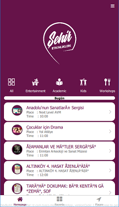

  ----------------------
  Event App Assignment
  ----------------------

About
-----

EventApp or *Şehir Etkinlikleri* is a mobile application which provides
all events in your city. It is currently available only for Ankara,
Turkey, but later who knows. Full version of this application can be
found in
[*here*](https://play.google.com/store/apps/details?id=tr.com.tusco.mobile.sehiretkinlikleri&hl=tr).

This version is an proof of concept of original one which is developed
by using V-Play Engine with Qt 5.10.1 Framework. In order to demonstrate
coding skills and documentation abilities:

-   Most of qml items are converted to V-Play items such as Flickable
    -\> AppFlickable, SwipeView -\> Navigation and StackView -\>
    NavigationStack
-   The documentation is created by using QDoc. Documentation procedure
    is learnt from [Collusions
    Game](https://github.com/anatolyk82/Collisions) and
    [QtNotifier](https://github.com/RSATom/Qt/blob/master/qtandroidextras/examples/androidextras/notification/doc/src/qtandroidextras-example-notification.qdoc)

### ScreenShots

+--------------------------+--------------------------+--------------------------+
|      | 
-   source ( \*.cpp, \*.h)
    -   main.cpp
    -   MainController.cpp
    -   communication
    -   data
    -   modelcontrollers
-   qml ( \*.qml)
-   docs (\*.qdoc, \*.qdocconf, \*.css , \*.html)

File informations and it's list are given in Section C++ files.

### UI Design Strategy

In this application, UI consits of a main StackNavigation and its
components. The first component of the item is selected as Navigation in
order to provide users to access most common options just by swiping
between tabs/pages. Then, whenever user selects an event, place or
category the application pushs another pages to stack to visualize
person's choice. The implementation of this scene is given below where
[MobileApp](mobileapp-qml.html) is inhereted from
[IAppProperties](iappproperties-qml.html) and IAppProperties is
inhereted from [App](https://v-play.net/doc/vplayapps-app/) component.

``` {.cpp}

  import QtQuick 2.4
  import VPlayApps 1.0
  import "items"
  import "pages/main"
  import "navigation"

  MobileApp {
      id: appWindow

      Page {
        // make navigation public, so app-demo launcher can track navigation changes and log screens with Google Analytics
        property alias childNavigationStack: globalNavStack
        property alias navigation: navigation
        useSafeArea: false // full screen

        NavigationStack {
            id: globalNavStack

            // Wrapper page
            Page {

                useSafeArea: false // full screen

                title: currentAppTitle;

                // To access Drawer anywhere from this level of stack.
                rightBarItem:NavigationBarItem {

                    // we specify the width of the item with the contentWidth property
                    // the item width then includes the contentWidth and a default padding
                    contentWidth: contentRect.width

                    // the navigation bar item shows a colored rectangle
                    Rectangle {
                      id: contentRect
                      width: dp(Theme.navigationBar.defaultIconSize)
                      height: width
                      anchors.centerIn: parent
                      color: "transparent";

                      Icon {
                        anchors.fill: parent
                        icon: IconType.navicon
                        color: Theme.navigationBar.itemColor

                        MouseArea
                        {
                            anchors.fill: parent;
                            onClicked: navigationBar.open();
                        }
                      }
                    }
                  } // NavigationBarItem

                Navigation {
                    id: navigation
                    // Comment to use a navigation drawer instead of tabs on Android
                    navigationMode: navigationModeTabs

                    onCurrentIndexChanged: swipeViewIndexChanged(currentIndex);

                    NavigationItem {
                        title: qsTr("Homepage");
                        icon: IconType.home
                        showInDrawer: false;

                        Homepage
                        {

                        }
                    }

                    NavigationItem {
                        title: qsTr("Recents")
                        icon: IconType.thlarge;

                        PageRecents {

                        }
                    }

                    NavigationItem {
                        title: qsTr("Places")
                        icon: IconType.locationarrow;

                        PagePlacesList {

                        }
                    }

                } // Navigation ends.

            } // Page ends.

        }//Stack ends
      }

      // Custom Drawer
      NavigationDrawerBar{
          id: navigationBar
      }
  }
```

As it can seen from the screenshots, to provide ability of accessing
drawer from any pages the following code snippet is added to each top
level Page component in the project.

``` {.cpp}

  // To access Drawer anywhere from this level of stack.
  rightBarItem:NavigationBarItem {

    // we specify the width of the item with the contentWidth property
    // the item width then includes the contentWidth and a default padding
    contentWidth: contentRect.width

    // the navigation bar item shows a colored rectangle
    Rectangle {
          id: contentRect
          width: dp(Theme.navigationBar.defaultIconSize)
          height: width
          anchors.centerIn: parent
          color: "transparent";


          Icon {
            anchors.fill: parent
            icon: IconType.navicon
            color: Theme.navigationBar.itemColor

            MouseArea
            {
                    anchors.fill: parent;
                    onClicked: navigationBar.open();
            }
          }
    }
  } // NavigationBarItem
```

### Setting Up Theme

The color combination of the application is set by Theme component of
Qt.

``` {.cpp}

  onInitTheme:
  {
          Theme.colors.backgroundColor = colorMain;
          // Theme.navigationAppDrawer.backgroundColor =colorMain;
          // Theme.navigationAppDrawer.itemBackgroundColor = colorMain;
           Theme.navigationBar.itemColor = "white"
           Theme.navigationBar.backgroundColor =colorMain;

          Theme.navigationBar.dividerColor = colorMain;
          Theme.navigationBar.titleColor = "white";
          Theme.tabBar.backgroundColor = "white";
          Theme.colors.tintColor = colorMain;
          Theme.tabBar.markerColor = colorMain;
          Theme.listSection.backgroundColor = colorMain;
          Theme.listSection.textColor = "white";

          Theme.update();

  }
```

Integrating C++ and QML
-----------------------

Backend and frontend are integrated to each other via
[MainController](maincontroller-cpp.html) class.

``` {.qml}

  MainController::MainController(QQmlContext *pRoot, QObject *parent)
      : QObject(parent)
      , mRoot(pRoot)
      , mCategoryEvents(NULL)
      , mRequestManager(NULL)
      , mHomepageRecents(NULL)
  {

      qmlRegisterType<EventContainer>();
      qmlRegisterType<PlaceContainer>();

      initialize();

  }

  void MainController::register2Meta()
  {
      mRoot->setContextProperty("RequestManager"  , mRequestManager );
      mRoot->setContextProperty("CategoryResults" , mCategoryEvents);
      mRoot->setContextProperty("PlacesResults"   , mPlacesController);
      mRoot->setContextProperty("HomeRecentEvents", mHomepageRecents);
  }
```

**See Also** [communication/RequestManager.cpp](requestmanager-cpp.html)
,
[modelcontrollers/AbstractEventController.cpp](abstracteventcontroller-cpp.html),
[modelcontrollers/AbstractPlacesController.cpp](abstractplacescontroller-cpp.html)

Presenting Data
---------------

Since this a live application, all data should be accessible from a
server. Therefore, a link is created to provide that ability and served
by RESTful service.

### Preparing Requests

In backend part, we accessed that data by sending GET and POST requests
which are declared in [RequestManager](requestmanager-cpp.html) class.

``` {.qml}

  /**
   * @brief RESTManager::GET creates GET request.
   * @param hostName : address of your REST request.
   * @param data : a map which contains parameters and their values to bind paraemeters to that request.
   */
  void RESTManager::GET(QString hostName, QMap<QString, QString> data)
  {
      QUrl url(hostName);

      if (data.size() < 1)
      {
          mAccessManager->get(QNetworkRequest(url));
          return;
      }

  /**
   * @brief RESTManager::POST creates POST request.
   * @param hostName : address of your REST request.
   * @param data : a map which contains parameters and their values to bind paraemeters to that request.
   */
  void RESTManager::POST(QString hostName, QMap<QString, QString> data)
  {
      QUrl url(hostName);

      if (data.size() < 1)
      {
          mAccessManager->get(QNetworkRequest(url));
          return;
      }
```

### Parsing Server Reply

At first, we connected messageReady2Parse signal to parseNetworkMessage
slot to notify [NetworkMessageParser](networkmessageparser-cpp.html)
when a new reply is received.

``` {.qml}

  //1
  void RequestManager::initializeConnections()
  {
      connect(mRESTManager , SIGNAL(messageReady2Parse(QString)), mParser, SLOT(parseNetworkMessage(QString)));

      connect(mParser , SIGNAL(requestMessageParsed(QString,QList<EventContainer*>)), this , SLOT(onEventMessageParsed(QString,QList<EventContainer*>)));
      connect(mParser , SIGNAL(placesMessageParsed(QString,QList<PlaceContainer*>)) , this , SLOT(onpPlacesMessageParsed(QString,QList<PlaceContainer*>)));
  }
```

Then, we parse JSON message to extract data in above slot.

``` {.qml}

      \fn void NetworkMessageParser::parseNetworkMessage(QString pMessage)
      Tries to parse given input message.
      \a pMessage is the input message observed from QNetworkReply
  */
  void NetworkMessageParser::parseNetworkMessage(QString pMessage)
  {
      mUnicodeDecoder.setHtml(pMessage);
      QString decoded = mUnicodeDecoder.toPlainText();

      QJsonDocument document = QJsonDocument::fromJson(decoded.toUtf8());
      QJsonObject  jsonObject = document.object();

      QJsonArray  jsonArray;

      try
      {
          QString tType =  jsonObject["request_type"].toString();

          if (tType == "places_view")
          {

              jsonArray = jsonObject["places"].toArray();
              QList<PlaceContainer*> tList;

              if (jsonArray.size() > 0)
              {
                  PlaceContainer *tContainer;

                  foreach (const QJsonValue & value, jsonArray) {

                      tContainer = new PlaceContainer();

                      QJsonObject obj = value.toObject();

                      tContainer->setName             (obj["name"].toString());
                      tContainer->setAddress          (obj["address"].toString());
                      tContainer->setCoordinate       (obj["coordinate"].toString());
                      tContainer->setTelephone        (obj["phone"].toString());
                      tContainer->setLink             (obj["website"].toString());
                      tContainer->setImage            (obj["image"].toString());

                      tList.append(tContainer);
                  }

                  if (tList.size() > 0)
                      emit placesMessageParsed(tType , tList);
              }
          }
          else
          {
              jsonArray = jsonObject["events"].toArray();
              QList<EventContainer*> tList;

              if (jsonArray.size() > 0)
              {

                  QString tEventTime; QStringList tStringList;
                  EventContainer *tContainer;
                  foreach (const QJsonValue & value, jsonArray) {

                      tContainer = new EventContainer();

                      QJsonObject obj = value.toObject();

                      tContainer->setID               (obj["id"].toString());
                      tContainer->setName             (obj["name"].toString());
                      // Rearranging date format to desired one.
                      QString tDate = obj["eventDate"].toString().replace(" ", "");
                      QStringList dates= tDate.split("-");
                      tDate = dates[2] + "." +  dates[1] + "." + dates[0];
                      tContainer->setEventDate(tDate);

                      // To able to create faster sectioning in QML ListViews, Date information is manipulated
                      int tSiralamaDegeri = QString(dates.at(2)).toInt()
                                          + QString(dates.at(1)).toInt() * 20
                                          + QString(dates.at(0)).toInt() * 10;
                      tContainer->setSiralamaOlcutu(tSiralamaDegeri);
                      // DiÄŸer deÄŸerler
                      tEventTime = obj["eventTime"].toString();
                      if (tEventTime == "00:00:00")
                          tEventTime = "BelirtilmemiÅŸ";
                      else
                      {
                          tStringList = tEventTime.split(":");
                          tEventTime = tStringList[0] + ":" + tStringList[1];
                      }
                      tContainer->setEventTime        (tEventTime);
                      tContainer->setCategory1        (obj["category1"].toString());
                      tContainer->setCategory2        (obj["category2"].toString());
                      tContainer->setYer              (obj["yer"].toString());
                      tContainer->setAddress          (obj["address"].toString());
                      tContainer->setCoordinate       (obj["coordinate"].toString());
                      tContainer->setTelephone        (obj["telefon"].toString());
                      tContainer->setLink             (obj["link"].toString());
                      tContainer->setRezervasyon      (obj["biletRezevasyon"].toString());
                      tContainer->setDescription      (obj["description"].toString());
                      tContainer->setTag1             (obj["tag1"].toString());
                      tContainer->setTag2             (obj["tag2"].toString());
                      tContainer->setTag3             (obj["tag3"].toString());
                      tContainer->setImageURL         (obj["imageURL"].toString());
                      tContainer->setModifiedDate     (obj["modifiedDate"].toString());

                      tList.append(tContainer);
                  }

              }

              if (tList.size() > 0)
                  emit requestMessageParsed(tType , tList);
          }

      }
      catch (...)
      {
          qCritical() << "An error occured while trying to parse given server reply.";
      }

  }
```

### Notifying QML Components

Since we get a list from server, it should be registered to Qt Meta
properly. Therefore we created two abstract class to provide base
implementation of registeration which are
[AbstractEventController](abstracteventcontroller-cpp.html) and
[AbstractPlacesController](abstractplacescontroller-cpp.html)
respectively. Sample implementation is given below.

``` {.cpp}

  \\ in header file.
  Q_PROPERTY(QQmlListProperty<EventContainer> eventList READ getEvents NOTIFY eventListChanged)

  \\ in cpp file. when we want to access this list from QML
  QQmlListProperty<EventContainer> AbstractEventController::getEvents()
  {
          return QQmlListProperty<EventContainer>(this, mEventList);
  }
  \\ in cpp file. When we get new list of events from server.
  void AbstractEventController::addEventData(QList<EventContainer *> pEvents)
  {
          mEventList.clear();
          mEventList.append(pEvents);

          emit eventListChanged();
  }
```

Additional Informations
-----------------------

### Used V-Play Functions

  -------------------------------------------------------------------------------------- ------------------------------------------------------------------------------------------------------------------------------------
  [**isOnline:**](https://v-play.net/doc/vplayapps-app/#isOnline-prop)                   Very useful to check the Internet connection.
  [**ListPage:**](https://v-play.net/doc/vplayapps-listpage/)                            Awesome component which provides functionality normaly achived by using Page, Flickable and Listview respectively.
  [**Camera Picker:**](https://v-play.net/doc/nativeutils/#displayCameraPicker-method)   Beter than QCaminho open source implementation and easier to use.
  [**Share:**](https://v-play.net/doc/nativeutils/#share-method)                         Easy to use.
  [**Navigation:**](https://v-play.net/doc/vplayapps-navigation/)                        Awesome compoenent which provides power of SwipeView and Tabbar compenents while binding their indexes to highlight related icons.
  [**NavigationStack:**](https://v-play.net/doc/vplayapps-navigationstack/)              popAllExceptFirstAndPush(source, options) function is so helpful.
  -------------------------------------------------------------------------------------- ------------------------------------------------------------------------------------------------------------------------------------

### Custom Components and Functions

#### Google Static Map : [GoogleStaticMapItem](qml-googlestaticmapitem.html)

Creates static map image dynamically with using Google's Static Map API.
A proper license key should be generated in order to use this API. For
more information about the API and its limitations please refere [*API
Reference*](https://developers.google.com/maps/documentation/maps-static/intro).

+--------------------------+--------------------------+--------------------------+
| [GoogleStaticMapItem](qm | Usage                    | Sample Output            |
| l-googlestaticmapitem.ht |                          |                          |
| ml)                      |                          |                          |
+==========================+==========================+==========================+
| ``` {.cpp}               | ``` {.qml}               |                     |
|   import QtQuick 2.7     |                   Google |                          |
|   import QtQuick.Layouts | StaticMapItem            |                          |
|  1.3                     |                   {      |                          |
|   import QtQuick.Control |                       vi |                          |
| s 2.1                    | sible: true;             |                          |
|   import QtGraphicalEffe |                       wi |                          |
| cts 1.0                  | dth: parent.width;       |                          |
|                          |                       he |                          |
|   Rectangle              | ight: dp(200);           |                          |
|   {                      |                       La |                          |
|           property strin | yout.fillWidth: true;    |                          |
| g staticApiKey: "";      |                       co |                          |
|           property real  | lor: "transparent";      |                          |
| latitude: 0;             |                          |                          |
|           property real  |                       st |                          |
| longitude: 0;            | aticApiKey: "AIzaSyD3crn |                          |
|           property real  | SmwEYtw31-5FKBKr5H-xAEpN |                          |
| pictureWidth: 800;       | gzvU";                   |                          |
|           property real  |                       la |                          |
| pictureHeight: 500;      | titude: getLatitudeFromI |                          |
|           property real  | nput(selectedPlacePage.m |                          |
| zoom: 16;                | odel.modelData.Coordinat |                          |
|           property real  | e);                      |                          |
| pictureHeight: 500;      |                       lo |                          |
|           property real  | ngitude: getLongitudeFro |                          |
| scale: 2;                | mInput(selectedPlacePage |                          |
|           property strin | .model.modelData.Coordin |                          |
| g title: "";             | ate);                    |                          |
|           property bool  |                       ti |                          |
| enableGetDirection: fals | tle:selectedPlacePage.mo |                          |
| e;                       | del.modelData.Name;      |                          |
|                          |                          |                          |
|           color: "transp |                       en |                          |
| arent";                  | ableGetDirection: true;  |                          |
|                          |                       fu |                          |
|           Image {        | nction getLatitudeFromIn |                          |
|                   id: go | put(pInput)              |                          |
| ogleMapStaticImage;      |                       {  |                          |
|                   proper |                          |                          |
| ty string constant: "htt |   var temp = pInput.spli |                          |
| ps://maps.googleapis.com | t(",");                  |                          |
| /maps/api/staticmap?key= |                          |                          |
| ";                       |   return temp[0];        |                          |
|                   proper |                       }  |                          |
| ty string url: constant  |                       fu |                          |
| + parent.staticApiKey    | nction getLongitudeFromI |                          |
|                     + "& | nput(pInput)             |                          |
| center=" + parent.latitu |                       {  |                          |
| de + ", " + parent.longi |                          |                          |
| tude                     |   var temp = pInput.spli |                          |
|                     + "& | t(",");                  |                          |
| zoom=" + parent.zoom     |                          |                          |
|                     + "& |   return temp[1];        |                          |
| size=" + Math.ceil(paren |                       }  |                          |
| t.pictureWidth) + "x"  + |                   }      |                          |
|  Math.ceil(parent.pictur |                   SpaceS |                          |
| eHeight)                 | electedEventPageContents |                          |
|                     + "& |  {visible: aciklama.visi |                          |
| markers=color:red|label: | ble}                     |                          |
| A|"                      | ```                      |                          |
|                     + "s |                          |                          |
| cale:2|"                 |                          |                          |
|                     + "t |                          |                          |
| itle:" + parent.title;   |                          |                          |
|                   proper |                          |                          |
| ty variant temp;         |                          |                          |
|                   proper |                          |                          |
| ty string latitude: "-34 |                          |                          |
| .397";                   |                          |                          |
|                   proper |                          |                          |
| ty string longitude: "15 |                          |                          |
| 0.644";                  |                          |                          |
|                          |                          |                          |
|                   source |                          |                          |
| : url;                   |                          |                          |
|                   width: |                          |                          |
|  parent.width;           |                          |                          |
|                   height |                          |                          |
| : parent.height;         |                          |                          |
|                   source |                          |                          |
| Size: Qt.size(width ,  h |                          |                          |
| eight);                  |                          |                          |
|                          |                          |                          |
|           }              |                          |                          |
|                          |                          |                          |
|           MouseArea      |                          |                          |
|           {              |                          |                          |
|                   anchor |                          |                          |
| s.fill: parent;          |                          |                          |
|                   onClic |                          |                          |
| ked:                     |                          |                          |
|                   {      |                          |                          |
|                          |                          |                          |
|   if (parent.enableGetDi |                          |                          |
| rection)                 |                          |                          |
|                          |                          |                          |
|   {                      |                          |                          |
|                          |                          |                          |
|           var directionU |                          |                          |
| RL =  "https://www.googl |                          |                          |
| e.com/maps?saddr=My+Loca |                          |                          |
| tion&daddr="             |                          |                          |
|                          |                          |                          |
|           + parent.latit |                          |                          |
| ude + "," + parent.longi |                          |                          |
| tude;                    |                          |                          |
|                          |                          |                          |
|           Qt.openUrlExte |                          |                          |
| rnally(directionURL);    |                          |                          |
|                          |                          |                          |
|   }                      |                          |                          |
|                   }      |                          |                          |
|           }              |                          |                          |
|   }                      |                          |                          |
| ```                      |                          |                          |
+--------------------------+--------------------------+--------------------------+

#### Sending EMail

Full sample code can be found in
[PageSelectedEvent.qml](pageselectedevent-qml.html)}
{PageSelectedEvent}. Opening the number dialer can done by using
legitimate URL scheme, which is ***tel:+*** For instance in
[PageSelectedEvent.qml](pageselectedevent-qml.html)} {PageSelectedEvent}
it is used as:

``` {.cpp}

  MouseArea
  {
          anchors.fill: parent;
          onClicked:  Qt.openUrlExternally("mailto:?to=iletisim@sehir-etkinlikleri.com&subject=Information&body=");
  }
```

which opens the default email program in your environment (Android,
Linux, Windows, IOS) and creates a template email which has subject
equals to *Information* and deliver address equals to
*iletisim@sehir-etkinlikleri.com*.

#### Opening Number Dialer

Full sample code can be found in [PageAbout](pageabout-qml.html).
Opening an email service can achieved by using legitimate URL scheme,
which is ***mailto:?*** For instance in {PageAbout.qml} {PageAbout} it
is used as:

``` {.cpp}

  onClicked:
       {
               if (callNumber.length > 3)
               {
                       Qt.openUrlExternally("tel:+" + callNumber);
               }
       }
```

Then, your environment default number dialer will pop.

C++ Files
---------

-   [modelcontrollers/AbstractEventController.cpp](abstracteventcontroller-cpp.html)
-   [modelcontrollers/AbstractEventController.h](abstracteventcontroller-h.html)
-   [modelcontrollers/AbstractPlacesController.cpp](abstractplacescontroller-cpp.html)
-   [modelcontrollers/AbstractPlacesController.h](abstractplacescontroller-h.html)
-   [modelcontrollers/CategoryEventsController.cpp](categoryeventcontroller-cpp.html)
-   [modelcontrollers/CategoryEventsController.h](categoryeventcontroller-h.html)
-   [data/EventContainer.cpp](eventcontainer-cpp.html)
-   [data/EventContainer.cpp](eventcontainer-cpp.html)
-   [MainController.cpp](maincontroller-cpp.html)
-   [MainController.h](maincontroller-h.html)
-   [communication/NetworkMessageParser.cpp](networkmessageparser-cpp.html)
-   [communication/NetworkMessageParser.h](networkmessageparser-h.html)
-   [data/PlaceContainer.cpp](placecontainer-cpp.html)
-   [data/PlaceContainer.cpp](placecontainer-cpp.html)
-   [communication/RESTManager.cpp](restmanager-cpp.html)
-   [communication/RESTManager.h](restmanager-h.html)
-   [communication/RequestManager.cpp](requestmanager-cpp.html)
-   [communication/RequestManager.h](requestmanager-h.html)
-   [modelcontrollers/TopRecentEventsController.cpp](toprecenteventscontroller-cpp.html)
-   [modelcontrollers/TopRecentEventsController.h](toprecenteventscontroller-h.html)

QML Files
---------

-   [qml/pages/main/Homepage.qml](homepage-qml.html)
-   [qml/IAppProperties.qml](iappproperties-qml.html)
-   [qml/Main.qml](main-qml.html)
-   [qml/MobileApp.qml](mobileapp-qml.html)
-   [qml/navigation/IAppProperties.qml](navigationbutton-qml.html)
-   [qml/navigation/IAppProperties.qml](navigationdrawerbar-qml.html)
-   [qml/pages/main/IAppProperties.qml](pageplaceslist-qml.html)
-   [qml/pages/main/PageRecents.qml](pagerecents-qml.html)
-   [qml/pages/selections/PageSelectedEvent.qml](pageselectedevent-qml.html)
-   [qml/pages/selections/PageSelectedPlace.qml](pageselectedplace-qml.html)
-   [qml/pages/selections/PageSelectedCategory.qml](pageselectedcategory-qml.html)
-   [qml/pages/others/PageAbout.qml](pageabout-qml.html)

© 2017 The Qt Company Ltd. Documentation contributions included herein
are the copyrights of their respective owners.\
 The documentation provided herein is licensed under the terms of the
[GNU Free Documentation License version
1.3](http://www.gnu.org/licenses/fdl.html) as published by the Free
Software Foundation.\
 Qt and respective logos are trademarks of The Qt Company Ltd. in
Finland and/or other countries worldwide. All other trademarks are
property of their respective owners.
